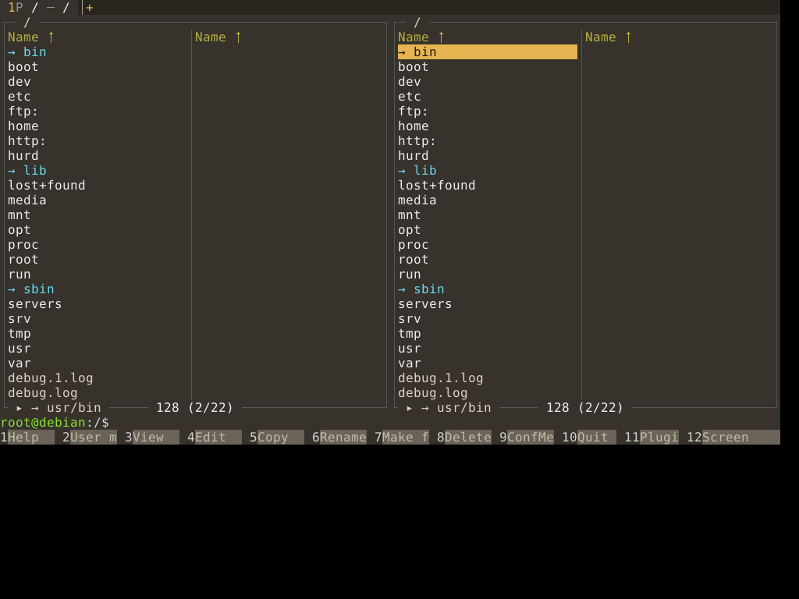
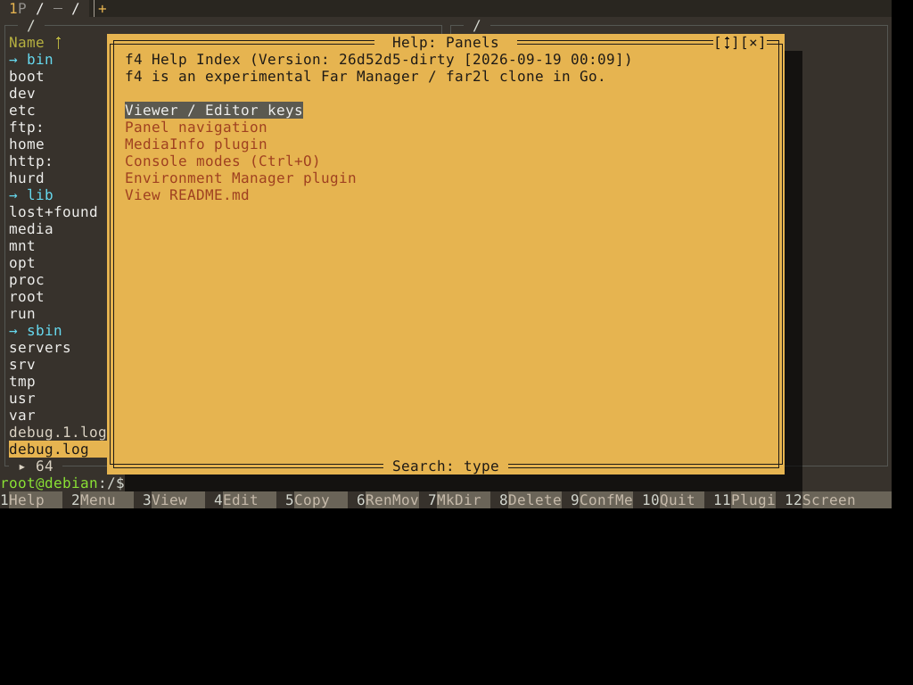
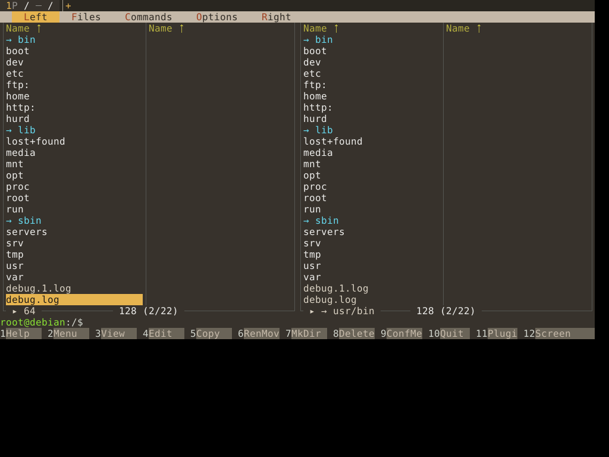

# f4 (unxed/f4) на GNU Hurd — рецепт сборки и снимок работы

Что получено (2026-09-19, run-hurd-poc #35409126369, QEMU/KVM): f4 собран под `GOOS=hurd` тулчейном из unxed/go, в госте Debian GNU/Hurd
рисует две панели на `/`, выполняет команду из командной строки во встроенном терминале (PTY + fork/exec + bash) и выходит по F10 с кодом 0.
Кадр — `screens/f4-hurd-root.txt`. Решение по объёму: **MVP = консоль и X11 без FFI; goffi/GPU не нужны.**
Бинарник (stripped, gzip, 27 МБ): https://github.com/unxed/debian-hurd/blob/main/poc/f4/f4.gz

## Как собирается (только в CI; в самом unxed/f4 пока ничего не изменено)

Workflow `workflows/hurd-f4-build.yml` лежит в unxed/go (ветка golang-1.26-hurd) и запускается пушем в `.github/f4-ref`
(`workflow_dispatch` работает только для default-ветки, а у unxed/go это haiku). Шаги: сборка тулчейна (с кэшем) → клон unxed/f4 →
`go mod vendor` → `scripts/hurd_retag.py` (в `//go:build` зависимостей и f4 `hurd` трактуется как `solaris`: libc-ОС без FFI, заглушки вместо GPU) →
подмена `vendor/golang.org/x/sys/unix` (`xsys-unix/` + константы из `scripts/gen_unix_consts.py`) → оверлей `overlay/pty_hurd.go` →
`GOOS=hurd CGO_ENABLED=0 go build ./cmd/f4`.

- `ext_hurd.go` — копия `src/syscall/ext_hurd.go` из unxed/go: дополнительные libc-вызовы (tcgetattr, tcsetattr, ioctl, poll, flock, getpgid,
  posix_openpt/grantpt/unlockpt/ptsname_r, mmap...) за одной pushed-linkname `syscall.extCall`. Из чужого пакета динамические импорты не линкуются.
- `f4-own-changes.patch` — правки build-тегов в файлах самого f4 (что надо перенести в unxed/f4 настоящим PR).
- PTY на Hurd — BSD-стиль: мастер `/dev/ptyXN`, слейв `/dev/ttyXN`; `posix_openpt` работает, мастер неблокирующий и pollable, `TIOCSCTTY` работает,
  `TIOCGPGRP` на мастере — нет (`IsBusy` спрашивает слейв). Замерено `../go-hurd/probes/pty_poc.c`.
- afero: `BADFD` = `EBADF` (на Hurd нет `EBADFD`).

## X11-бэкенд (чистый Go, без FFI) — работает

f4 `--gui=x11` (jezek/xgb + purexkb, никакого goffi) в госте Hurd подключается по TCP к **Xvfb на хосте CI** (`DISPLAY=10.0.2.2:1`), окно рисуется там,
ввод и скриншоты — с хоста (xdotool, ImageMagick `import`). Как и для Redox: X-сервера в образе Hurd нет, а сеть есть — QEMU `-nic user,model=e1000`,
гость получает `10.0.2.15` по DHCP, хост виден как `10.0.2.2` (проверено wget/ping). Запуск в госте:
`DISPLAY=10.0.2.2:1 f4 --gui=x11 --attached` (`--attached`, иначе f4 отсоединяется и выходит), на хосте `Xvfb :1 -screen 0 1024x768x24 -listen tcp -ac`.
Оконного менеджера нет: фокус следует за указателем, поэтому перед клавишами сценарий кликает в окно. Сценарий — в `../go-hurd/probes/run_poc.py`
(блок «f4's X11 backend»), workflow — `../go-hurd/probes/run-hurd-poc.yml`; run-hurd-poc #35411660397: старт, F1, стрелки, F9, F10 → выход с кодом 0.
Предупреждения XGB про `.Xauthority` безвредны.

| старт | справка F1 | меню F9 |
|---|---|---|
|  |  |  |

## Что осталось

- PR в f4/vtui/vtinput: `hurd` в build-теги, `pty_hurd.go`; порт (или отдельный модуль) `x/sys/unix` для Hurd.
- `daemonStartTimeout = 10s` в f4 (сессионный демон) мал для TCG-эмуляции; с KVM не проявляется.
