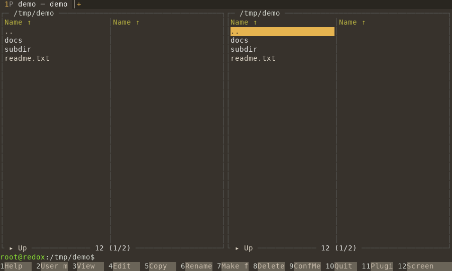
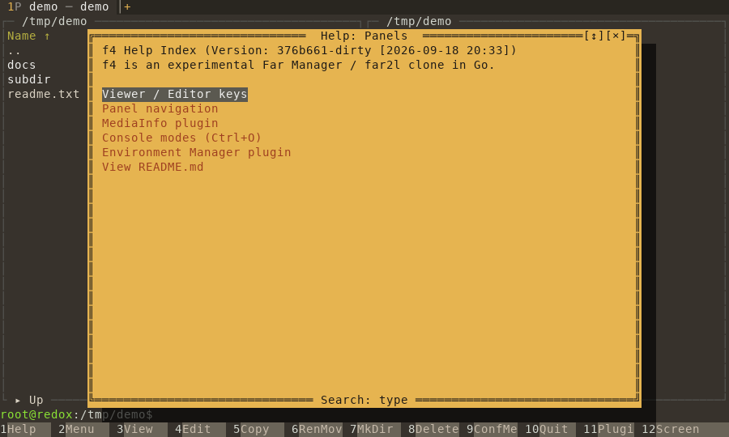
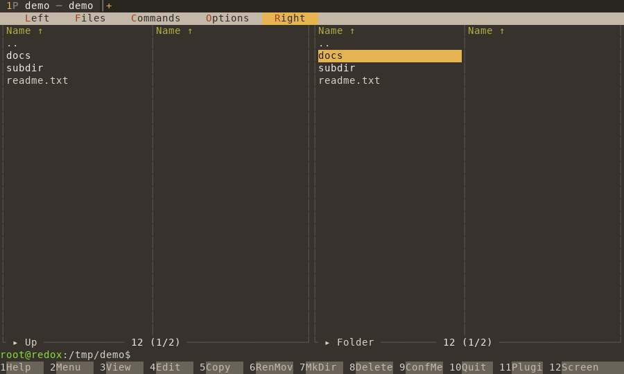

# f4 → Redox OS (sandbox)

**Статус на 2026-09-18: `github.com/unxed/f4` собирается под `GOOS=redox GOARCH=amd64`
(`CGO_ENABLED=0`) и работает на Redox OS в консольном (TTY) режиме: две панели, реальный
листинг каталога, F-клавиши, Help (F1), меню (F9), встроенная оболочка.** Всё собирается и
запускается только в GitHub Actions этого репозитория
(`.github/workflows/f4-redox.yml`), локально ничего не собиралось. Скриншоты — в
[`screens/`](screens/) (PNG + текстовый дамп экрана из VM Redox).

| панели | Help (F1) | меню (F9) |
|---|---|---|
|  |  |  |

## Как это устроено

1. **Тулчейн.** `unxed/go`, ветка `golang-1.26-redox` (порт Go на Redox поверх relibc,
   `libc.so.6`), закреплён по SHA в workflow (`GO_REDOX_SHA`); собирается один раз и
   кэшируется (`actions/cache`), раунд CI ~1.5 мин при неизменном тулчейне.
2. **f4 и зависимости** клонируются/копируются из module cache в CI и правятся скриптами
   из `f4-redox/scripts/` (реальные репозитории не трогаются):
   - `xsys-redox/unix/` — минимальный `golang.org/x/sys/unix` для redox (вызовы libc через
     `runtime.syscall_sysvicall6`, как это делает x/sys на Solaris; константы из пакета
     `syscall` порта генерирует `gen_zconst.py`, termios — из `relibc`);
   - `redox_tags.py` — «Redox присоединяется к спискам illumos/solaris» в `//go:build`
     (f4, vtui, zip, tar, wazero, sqlite3, sftp, x/term); vtui при этом уходит от GPU/goffi
     на заглушку (goffi для MVP не нужен);
   - `fix_stat_ids.py` — `Stat_t.Uid/Gid` (в порту были int32) оборачиваются в `uint32(...)`;
   - `overlay/f4/internal/terminal/pty_redox.go` — PTY на Redox: мастер
     `/scheme/pty/ptmx`, `TIOCSPTLCK` → `TIOCGPTN` (порядок важен: пока pty «заперт»,
     `TIOCGPTN` даёт EIO) → слейв `/scheme/pty/N`;
   - в `prep_modules.sh`: TTY-режим f4 на redox запускается одним процессом (`runAttachedSession`,
     как на FreeBSD), без клиент-серверной пары с передачей fd по `AF_UNIX`/`SCM_RIGHTS`.
3. **Запуск.** Отдельная VM Redox под `redoxer`/QEMU **с KVM** (`/dev/kvm` на раннере
   включается правилом udev), ядро — пропатченное (`kernel-forcekill-lost-wakeup`, см.
   соседний каталог), внутри VM: `f4 --version/--help/--list-mounts`, затем `ptyrun`
   (`harness/ptyrun`, Go-утилита под redox) запускает `f4 --tty` на pty, посылает клавиши и
   снимает «snapshots» вывода; на хосте `scripts/render_screens.py` проигрывает байты через
   эмулятор терминала (pyte) и рисует текст + PNG.

## Что проверено (на pinned unxed/go c6fbbabd, ядро с патчем)

- `f4 --version`, `--help`, `--list-mounts`: ок.
- `f4 --tty` в pty: 5 запусков из 6 сразу рисуют панели и отвечают на F1/F9 (см. скриншоты);
  один запуск (холодный, первый в VM) не успел нарисоваться за 6 с.
- Листинг каталога, навигация, Help, меню — работают. Опрос терминала (CSI 14 t и др.)
  отвечает `ptyrun`.

## Найденные и исправленные по дороге проблемы

| проблема | где | решение |
|---|---|---|
| `TIOCGPTN` → EIO | relibc/ptyd: пока pty заперт | `TIOCSPTLCK` перед `TIOCGPTN` |
| `poll failed` (EPERM), демон f4 падает на старте | порт Go: `poll` в relibc падает целиком на обычном файле | вошло в unxed/go (`netpollopen` пробует fd) |
| `MakeRaw not implemented on redox/amd64` | `x/term` не знал redox | redox в списки `x/term`, termios-константы из relibc |
| зависание всего процесса (GC stop-the-world, `signal.Notify`), все M припаркованы | ядро индексирует futex физическим адресом, `fork` делает CoW → потерянные пробуждения | `posix_spawn` вместо fork + `sem_timedwait` слайсами в рантайме (unxed/go) |
| `Stat_t.Uid` int32 вместо uint32 | порт Go | исправлено в unxed/go (uint32), обёртки в CI остались безвредными |

## Не сделано / открыто

- x11-бэкенд f4 компилируется под redox (без FFI), но не запускался: X-сервера в образе Redox
  нет (рецепты `xserver-xorg` есть только в `recipes/wip/x11` cookbook и не собираются в образ).
  План: Xvfb на раннере CI по TCP и `DISPLAY=10.0.2.2:N` из гостя.
- Асинхронная вытесняемость отключена в рантайме (баг relibc `sigentry`, патч отправлен на
  GitLab пользователем) — плотный цикл без вызовов может задерживать GC.
- Редкие зависания при выходе процесса (ядро, патч в `kernel-forcekill-lost-wakeup/`).
- Реальный терминал Orbital/Cosmic (не pty-харнесс) и запись сценариев кликов — см. `vmlab/`.
